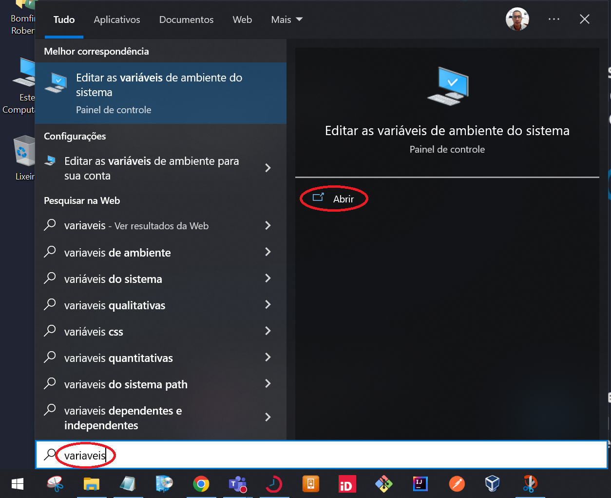
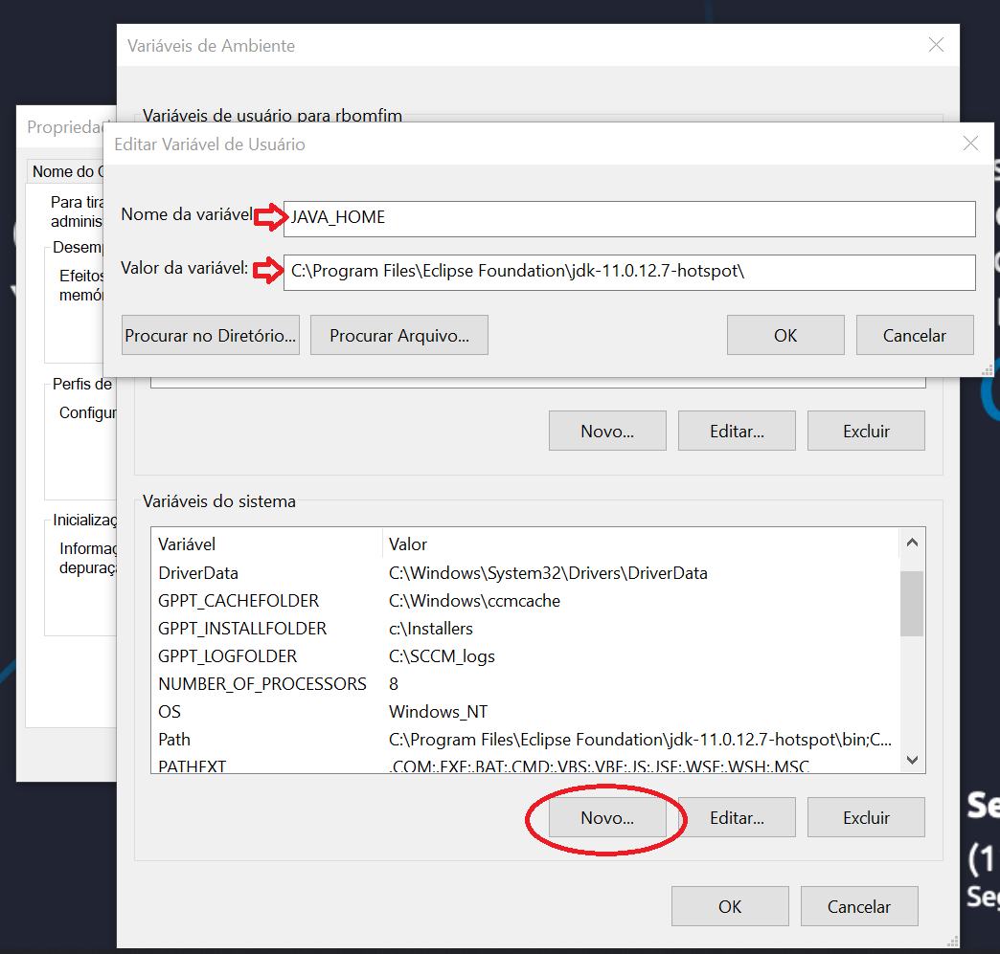

 # **Java Base to Monster** 

---

## Guia inicial, rápido, para se tornar um Monster

### Por onde começar

#### Preparação do Ambiente de Desenvolvimento

Para começar, você vai precisar dos seguintes recursos:

- JDK 11 (Java Development Kit)
- IntelliJ IDEA CE (Community Edition)

Se você já tiver os dois, vá para o próximo passo: "Fork do Repositório"

Verifique se o JDK já está instalado:

​	Abra o prompt de comando em seu computador digitanto "cmd" (sem aspas) na barra de pesquisa do Windows e clique em "Command Prompt" (ou Prompt de Comando):


				
Na janela do Command Prompt, digite: **java --version** e tecle "Enter" para verificar a versão do JDK instalado


Caso você receba uma mensagem diferente da que está na imagem anterior, significa que você precisa fazer a instalação.

Verifique também a versão do compilador Java. Digite: **java --version** no promt de comando, conforme a figura a seguir


Se você já tem o JDK instalado, pule para o passo "Instalação do IntelliJ IDEA CE"

Caso ainda não tenha o JDK instalado, siga estes passos:

https://www.oracle.com/java/technologies/downloads/#java11


### Configuração de variáveis de ambiente

-  Clique no ícone do windowns
-  Pesquise por variáveis de ambiente e clique
-  Depois clique em variáveis de ambiente




- Clique em editar variáveis de ambiente
- Clique em new em variáveis de sistema
- Coloque no nome da variável
```bash
JAVA_HOME
```
- Depois no valor endereço do caminho do jdk




#### Instalação do IntelliJ IDEA CE

https://www.jetbrains.com/pt-br/idea/download/#section=windows


#### 1 - Fork do Repositório

O primeiro passo é fazer o fork deste repositório. Mas o que é Fork?

> "Um fork é uma cópia de um repositório. Bifurcar um repositório permite  que você faça experiências à vontade sem comprometer o projeto original."

> [Referência](https://docs.github.com/pt/get-started/quickstart/fork-a-repo)

Clique no botão "Fork"

- para um passo-a-passo mais detalhado acesse o link: https://cap-flix.notion.site/Passo-a-Passo-para-fork-do-projeto-5d5b45758b51486dbab6c631e403c282


 ###  Criar conta no GitLab
Primeiramente você precisa ter uma conta no GitLab, se já possui pode ir para a Etapa 2. Caso não possua uma conta, só clicar no link abaixo para se cadastrar.

https://gitlab.com/users/sign_up

Após a criação da conta no GitLab, você deverá aguardar o contato do seu Coach para ser adicionado ao grupo.


Nessa tela possuímos alguns detalhes, como:

- Project name
- Project description (optional)

Vamos começar com o ‘Project name’, por padrão ele virá com o nome: ‘java-base-to-monster’, você deverá acrescentar após o ‘monster’ um ‘-’ e as iniciais do seu email da Capgemini separadas pelo simbolo ‘-’. Exemplo, meu email da capgemini é ‘francisco.a.santana@capgemini.com’, então o meu ‘Project name’ ficará assim ‘java-base-to-monster-francisco-a-santana’.


Confira o nome e descrição do repositório e clique no botão "Create Fork" ou semelhante:

Pronto! Você já tem uma cópia do repositório na sua conta pessoal do GitLab.


Agora você já está pronto para seguir para o próximo passo.


#### 2 - Clone

Chegou a hora de colocar o repositório dentro do seu computador. O clone vai ser fundamental para facilitar o seu trabalho.

Se você ainda não tem o [Git](https://github.com/git-for-windows/git/releases/download/v2.37.3.windows.1/Git-2.37.3-64-bit.exe) instalado no seu computador, faça o [download](https://github.com/git-for-windows/git/releases/download/v2.37.3.windows.1/Git-2.37.3-64-bit.exe) e instale a ferramenta.

Crie uma pasta vazia, no melhor lugar do seu computador, para armazenar os seu repositórios. Abra a pasta no Windows Explorer e abra a seu gitbash.

````
git clone <link-do-projeto>
````

Se você conseguiu realizar todas as etapas e possui o seu projeto, agora só colocar a mão na massa 

#### 3 - Acesso

- Crie sua conta, gratuita, no [Jira Software](https://www.atlassian.com/software/jira/free) com o seu e-mail pessoal(não o da Capgemini)
- Solicite o acesso ao jira do seu time com seu coach/responsável
- Após o acesso ser liberado, espere mais orientações sobre como usar o JIRA
- Siga as tarefas na sua "Active Sprint"

#### 4 - Mais informações

- No caso de dúvidas acesse: https://cap-flix.notion.site/Monster-Factory-Capgemini-c68d7550d3d04aee9a2632cde5b6010a
